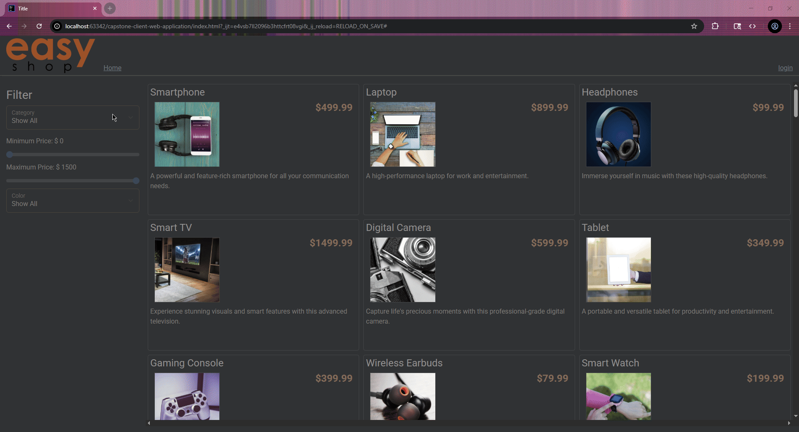

# Digital Emporium

## Description of the Project

Welcome to the Easy Shop! This program reads and updates an SQL database and is a web application ran on the local machine.
These products populate the store, where users can filter available products by category/color/price, and place them in a virtual cart!
Users can create register profiles to access the virtual cart, admins alone have privileges to update and delete data.

## User Stories

-As a user, I'd like to filter by color/price/category from a large selection of products to find 
my desired product hassle-free.

-As a user, I'd like to register a profile to save my cart, orders, and access the site on 
a personal basis.

-As a user, I'd like to update my profile so that I can update important information such as my 
shipping address or phone number.

-As an owner, I'd like to restrict editing and deleting data to administrators so that I can avoid 
malicious actors vandalizing my virtual shop.

-As a user, I'd like some of the bugs fixed, so that I can use the website as intended.

-As an owner, I'd like to keep track of my orders so that I can deliver products on a mass scale as my shop grows.

## Setup

### Prerequisites

- IntelliJ IDEA: Ensure you have IntelliJ IDEA installed, which you can download from [here](https://www.jetbrains.com/idea/download/).
- Java SDK: Make sure Java SDK is installed and configured in IntelliJ.

### Running the Application in IntelliJ

Follow these steps to get your application running within IntelliJ IDEA:

1. Open Easy-Shop IntelliJ IDEA Project.
2. Select "Open" and navigate to the directory where you cloned or downloaded the project.
3. After the project opens, wait for IntelliJ to index the files and set up the project.
4. Find the main class with the `public static void main(String[] args)` method.
5. Right-click on the file and select 'Run 'YourMainClassName.main()'' to start the application.
6. Open capstone-client-web-application IDEA Project
7. Navigate to index.html
8. Open relevant browser (Alt+F2 for Chrome)

## Technologies Used

- Java: Maven 17.
- Java I/O, scanners/file reading.

## Demo

## Future Work

- Full implementation of Check Out Orders
- Website improvements
- Improvement of error handling, improvement of performance.

## Resources

- [Raymond Maroun's GitHub](https://github.com/RayMaroun/yearup-spring-section-10-2025/tree/master/pluralsight) - Vital Information
- [Previous Java Project](https://github.com/AdampJessie/) - Similar, previously reviewed topics
- [Potato Sensei](https://chatgpt.com/g/g-681d378b0c90819197b16e49abe384ec-potato-sensei/c/685e0e47-0740-8006-ad8a-6a9359f73030) - Wonderful spud buddy!

## Team Members

- **Adam Jessie** - Categories/Shopping Cart/Profile Controller
- **Raymond Maroun** - Foundational Skeleton Code

## Thanks

- Thank you to instructor Raymond Maroun for unending support and guidance.
- A special thanks to all individuals who view/use this project!
 